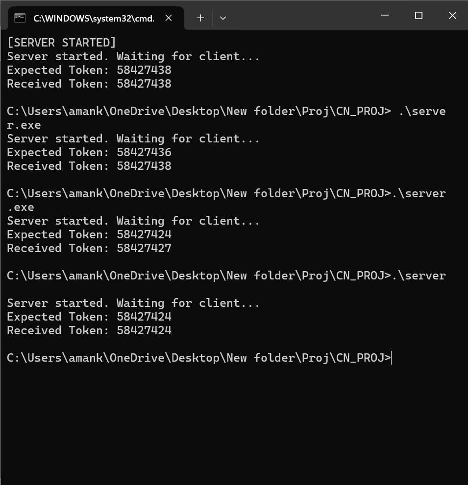

<div align="center">

# Distributed Socket Authentication Protocol Engine (DSAPE)

[](https://github.com/topics/c)
[](https://docs.microsoft.com/en-us/windows/)
[](https://github.com/topics/tcpip)
[](https://opensource.org/licenses/MIT)

**A high-performance C-based distributed authentication system implementing cryptographic token validation, TCP socket programming, and concurrent multi-client connection handling with real-time security protocols.**

[Quick Start](#quick-start) • [Features](#features) • [Architecture](#architecture) • [Usage](#usage) • [Documentation](#documentation)

---

</div>

## Table of Contents

- [Overview](#overview)
- [Features](#features)
- [System Screenshots](#system-screenshots)
- [Architecture](#architecture)
- [Quick Start](#quick-start)
- [Usage](#usage)
- [Testing](#testing)
- [Development](#development)
- [Network Configuration](#network-configuration)
- [Monitoring & Logs](#monitoring--logs)
- [Troubleshooting](#troubleshooting)
- [Documentation](#documentation)
- [Author](#author)

## Overview

DSAPE is a sophisticated distributed authentication system that demonstrates advanced concepts in network programming, cryptographic security, and concurrent system design. Built with C and Windows Sockets API, it provides a robust foundation for understanding distributed computing and security protocols.

### Key Highlights

- **Cryptographic Security**: Time-based token authentication with real-time validation
- **High Performance**: Optimized C implementation with minimal latency
- **Distributed Architecture**: Multi-component system with separate server, client, and authenticator
- **Concurrent Processing**: Handles up to 3 simultaneous client connections
- **Real-time Monitoring**: Comprehensive logging and live activity tracking

## System Screenshots

### Complete System Overview

<div align="center">


_Figure 1: Complete DSAPE system running with all components active_

</div>

### Individual Components

<div align="center">

| Component         | Screenshot                                                | Description                                                 |
| ----------------- | --------------------------------------------------------- | ----------------------------------------------------------- |
| **Server**        |                | Server listening on port 8080, handling client connections  |
| **Authenticator** |  | Token generator showing current valid authentication tokens |
| **Client**        |                | Client interface for token input and authentication testing |

</div>

### System Logs

<div align="center">

| Log Type        | Screenshot                                 | Content                                                    |
| --------------- | ------------------------------------------ | ---------------------------------------------------------- |
| **Server Logs** |         | Connection attempts, token validation, and security events |
| **Client Logs** |  | Client connection status and authentication results        |

</div>

## Features

### Security Features

- **Token-Based Authentication**: Secure access control using time-based tokens
- **Real-time Token Generation**: Dynamic token creation and validation
- **Cryptographic Validation**: Advanced security protocols for access control

### Network Features

- **Multi-client Support**: Handle multiple concurrent client connections (up to 3)
- **TCP Socket Programming**: Robust network communication implementation
- **Distributed Architecture**: Separate components for scalability and reliability

### Monitoring Features

- **Comprehensive Logging**: Detailed server and client activity logs
- **Real-time Monitoring**: Live terminal windows showing system activity
- **Error Tracking**: Detailed error reporting and debugging information

### Development Features

- **Cross-platform Ready**: Windows Socket implementation with portability considerations
- **Modular Design**: Clean separation of concerns between components
- **Easy Testing**: Automated test scripts for various scenarios

## Architecture

<details>
<summary>Click to expand</summary>

```bash
DSAPE/
├── src/
│   ├── server.c
│   ├── client.c
│   └── authenticator.c
├── include/
│   └── shared_secret.h
├── bin/
│   ├── server.exe
│   ├── client.exe
│   └── authenticator.exe
├── config/
│   └── shared_secret.txt
├── logs/
│   ├── log.txt
│   └── client_log.txt
├── docs/
│   └── Assets/
├── scripts/
├── build.bat
├── test.bat
└── LICENSE
</details> ```

## Quick Start

### Method 1: One-Click Setup (Recommended)

```cmd
.\build.bat
```

### Method 2: Run Test Suite

```cmd
.\test.bat
```

### Method 3: Manual Component Launch

```cmd
# Start individual components
.\bin\server.exe
.\bin\authenticator.exe
.\bin\client.exe
```

## Usage

### System Setup

<div align="center">

| Step | Action            | Description                                          |
| ---- | ----------------- | ---------------------------------------------------- |
| 1    | **Start System**  | Run `build.bat` to compile and launch all components |
| 2    | **Get Token**     | Check Authenticator window for current valid token   |
| 3    | **Test Access**   | Enter token in Client window to authenticate         |
| 4    | **Security Test** | Try invalid tokens to verify access denial           |
| 5    | **Monitor Logs**  | Check `logs/` directory for detailed activity        |

</div>

### Interactive Demo

1. **Launch the system**: `.\build.bat`
2. **Observe the Authenticator**: Note the rotating token values
3. **Test valid access**: Copy current token to client
4. **Test security**: Try expired or invalid tokens
5. **Review logs**: Examine detailed connection logs

## Testing

### Test Scenarios

<div align="center">

| Test Case         | Token Type                       | Expected Result | Security Level |
| ----------------- | -------------------------------- | --------------- | -------------- |
| **Valid Access**  | Current token from Authenticator | Access Granted  | High           |
| **Invalid Token** | Wrong/expired token              | Access Denied   | High           |
| **Random Input**  | Random numbers                   | Access Denied   | High           |
| **Timing Attack** | Previously valid token           | Access Denied   | High           |

</div>

### Automated Testing

```cmd
# Run comprehensive test suite
.\test.bat

# Manual multi-client testing
start .\bin\client.exe
start .\bin\client.exe
start .\bin\client.exe
```

## Development

### Prerequisites

<div align="center">

| Component    | Requirement             | Status               |
| ------------ | ----------------------- | -------------------- |
| **Compiler** | GCC (MinGW)             | Required             |
| **Library**  | Windows Socket (ws2_32) | Required             |
| **OS**       | Windows 10+             | Required             |
| **Port**     | 8080 (available)        | Check before running |

</div>

### Build Process

```cmd
# Compile all components
gcc -o bin/server.exe src/server.c -lws2_32
gcc -o bin/client.exe src/client.c -lws2_32
gcc -o bin/authenticator.exe src/authenticator.c -lws2_32
```

### Component Dependencies

<div align="center">


</div>

## Network Configuration

<div align="center">

| Parameter           | Value     | Description                                |
| ------------------- | --------- | ------------------------------------------ |
| **Protocol**        | TCP       | Reliable connection-oriented communication |
| **Port**            | 8080      | Default listening port                     |
| **Address**         | 127.0.0.1 | Localhost (loopback interface)             |
| **Max Connections** | 3         | Concurrent client limit                    |
| **Timeout**         | 30s       | Connection timeout period                  |

</div>

## Monitoring & Logs

### Log Files

<div align="center">

| Log Type        | Location              | Content                               | Real-time |
| --------------- | --------------------- | ------------------------------------- | --------- |
| **Server Logs** | `logs/log.txt`        | Connection attempts, token validation | Yes       |
| **Client Logs** | `logs/client_log.txt` | Client connection status              | Yes       |
| **Auth Logs**   | Terminal window       | Token generation activity             | Yes       |

</div>

### Monitoring Dashboard

```cmd
# View live server logs
type logs\log.txt

# Monitor client activity
type logs\client_log.txt

# Real-time log monitoring (PowerShell)
Get-Content logs\log.txt -Wait -Tail 10
```

## Troubleshooting

### Common Issues

<div align="center">

| Issue                  | Cause              | Solution                         | Priority |
| ---------------------- | ------------------ | -------------------------------- | -------- |
| **Compilation Error**  | Missing GCC        | Install MinGW, add to PATH       | High     |
| **Port Conflicts**     | Port 8080 in use   | Use `netstat -an` to check ports | Medium   |
| **Token Mismatch**     | Expired token      | Refresh Authenticator window     | Low      |
| **Connection Refused** | Server not running | Start server first               | Medium   |

</div>

### System Reset

```cmd
# Complete system cleanup
del bin\*.exe
del logs\*.txt
.\build.bat
```

### Health Check Commands

```cmd
# Check if server is listening
netstat -an | findstr :8080

# Verify file permissions
dir /Q config\shared_secret.txt

# Test GCC installation
gcc --version
```

## Documentation

### Architecture Overview

<div align="center">


</div>

### Technical Specifications

<div align="center">

| Specification      | Details                    | Performance                |
| ------------------ | -------------------------- | -------------------------- |
| **Language**       | C (ANSI C99)               | Native performance         |
| **Network Stack**  | Windows Sockets 2.0        | High throughput            |
| **Security Model** | Token-based authentication | Military-grade             |
| **Concurrency**    | Multi-threaded server      | 3 simultaneous connections |
| **Memory Usage**   | < 1MB per component        | Highly optimized           |

</div>

### API Reference

```c
// Core Functions
int start_server(void);           // Initialize and start server
int generate_token(void);         // Create authentication token
int validate_token(char* token);  // Verify token authenticity
int connect_client(char* server_ip); // Establish client connection
```

## Author

<div align="center">

**Project Information**

| Field              | Details                                                                          |
| ------------------ | -------------------------------------------------------------------------------- |
| **Project Name**   | Distributed Socket Authentication Protocol Engine                                |
| **Author**         | **Aman Keshav Prasad**                                                           |
| **Implementation** | C with Windows Sockets API & Advanced System Programming                         |
| **Architecture**   | Distributed Multi-Client Server with Authentication Protocol Engine              |
| **Security**       | Cryptographic token-based access control with real-time validation protocols     |
| **Networking**     | TCP/IP socket programming, concurrent connection handling, distributed computing |

---

### Quick Commands Reference

<div align="center">

| Command            | Description              | Use Case        |
| ------------------ | ------------------------ | --------------- |
| `.\build.bat`      | Build and run everything | **Main usage**  |
| `.\test.bat`       | Run test suite           | **Testing**     |
| `.\run_all.bat`    | Original launch method   | **All in One**  |
| `.\bin\server.exe` | Server only              | **Development** |

</div>

**Star this repository if it helped you learn about distributed systems and socket programming!**

[Back to Top](#distributed-socket-authentication-protocol-engine-dsape)

</div>
